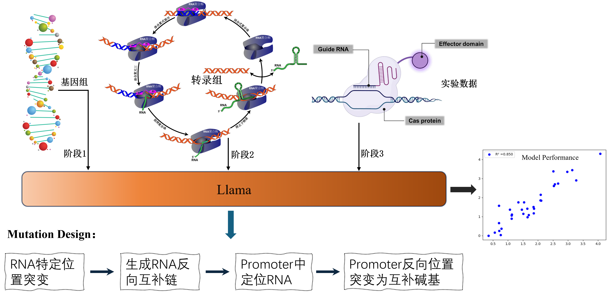

<div align=center>
<h1>GEO-SeqGuider: A quantitative predictive large language model specifically designed for the gene editing system of Pseudomonas putida.</h1>
</div>



## Important links:  
- [Paper:XXXX](https://arxiv.org/abs/XXXXXXX)
- [Huggingface: model weights](https://huggingface.co/lileica/GEO-SeqGuider)
- [Dataset: Zenodo]( https://doi.org/XXXX/zenodo.XXX)

## Introduction
> - GEO-SeqGuider is a quantitative predictive large language model specifically designed for the gene editing system of Pseudomonas putida.
GEO-SeqGuider is a model built upon the Llama framework. Through a two-stage learning process involving genomic data and gene editing systems, it ultimately achieves the goal of predicting gene expression levels based on promoter, sgRNA, and PAM sequences associated with the gene editing system.
> - We describe GEO-SeqGuider in our paper[XXX](https://doi.org/XXXX)


## Installation with conda
```bash
    conda env create -f environment.yml
    conda activate GEOSeqGuiderEnv
```

## Applications

### pretiction step by step

#### step 1
Download model weights from huggingface
```bash
git clone https://huggingface.co/lileica/GEO-SeqGuider localModel
```

#### step 2
Predict with local model weights
```bash
    python GEOSeqGuider.py --model=localModel --promoter="XXXX" --sgRNA='XXXX' --PAM='XXXX' --out_dir='XXXX'
```


# Citing this work

If you use the code or data in this package, please cite:

```bibtex
@Article{XXX,
  author  = {XXX,XXX,XXX},
  journal = {CNS},
  title   = {XXXXXXXXXXX},
  year    = {2026},
  volume  = {14},
  URL={https://www.XXXX},       
	DOI={XXX.2026.XXX},      
	ISSN={XXXX-XXXX}
}
```